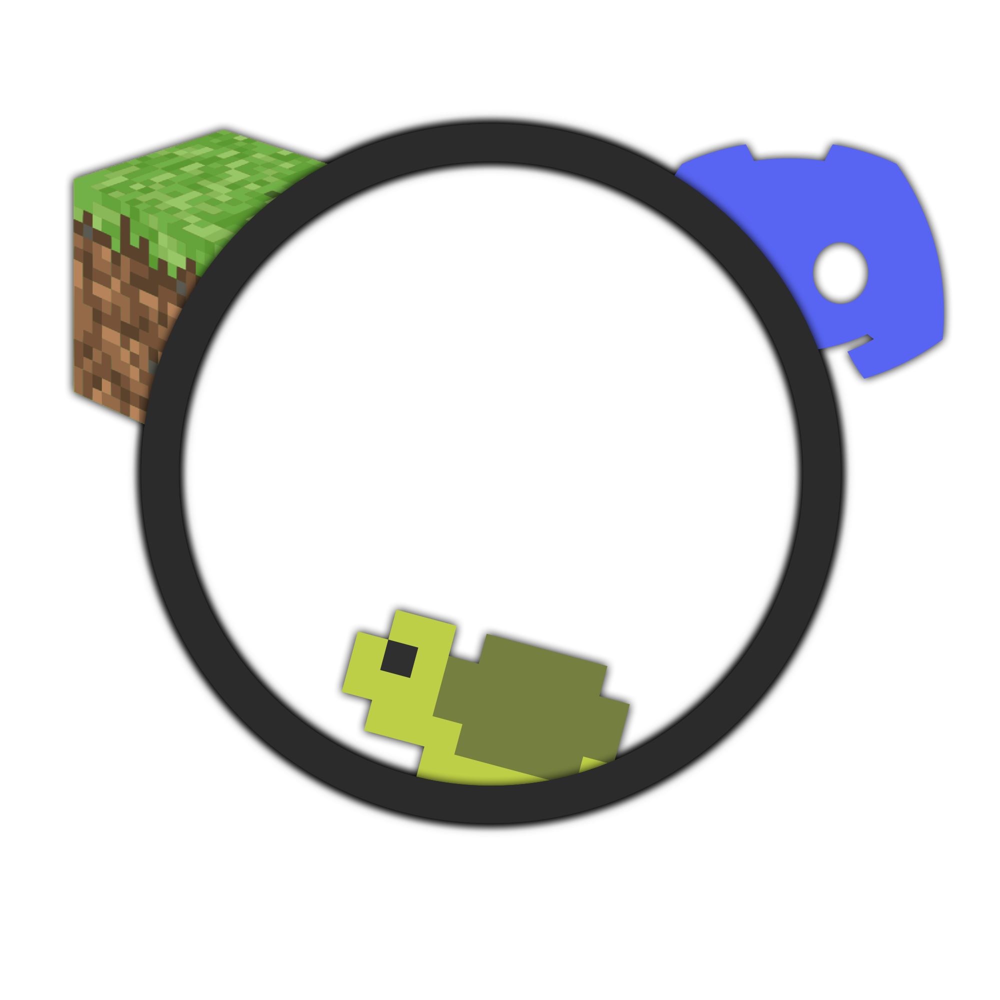
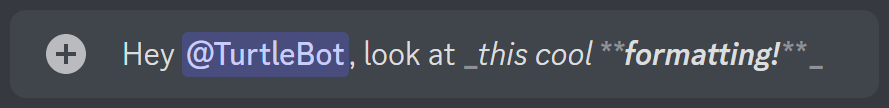
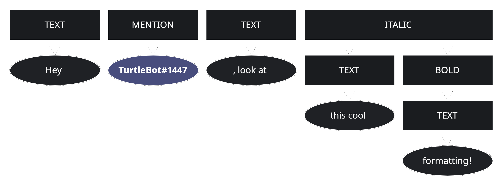

[version-shield]: https://img.shields.io/badge/Version-pre--alpha-red
[license-shield]: https://img.shields.io/github/license/TurtleException/FancyFormat



![version-shield]
![license-shield]

# FancyFormat
A simple library to translate message formats like
[Minecraft legacy formatting codes](https://minecraft.fandom.com/wiki/Formatting_codes),
[Minecraft JSON text format](https://minecraft.fandom.com/wiki/Raw_JSON_text_format) or
[Discord Markdown](https://support.discord.com/hc/en-us/articles/210298617).
The two main goals of this project are performance and lossless translation. Sadly, the latter is not always possible
since different message formats have different visualization features.

To allow applications to use this library for logging a new format is introduced: The **Turtle Format** - A simple, easy
to expand JSON-based format that supports all features that are available in one or more other supported formats. This
new format can be used to store messages without sacrificing information (by storing text in only one format) or using
too much disk space (by storing text in all formats).

### Work in progress!
This project is still in development and does not have a stable release yet.
Sadly, I can't provide an exact due date, but it should be finished before 2023.

## How it's done
To translate one message format to another, the given message & format are used to create an Abstract Syntax Tree (AST),
a data structure that can be used for syntax analysis. This is an easy way to handle messages in-memory. Each node of
the AST holds some information about the formatting of its children **or** is a raw text element. This makes nested
formatting possible and easy to interpret / parse.

**So, in less fancy words**, a message is converted into some data structure, which can then be used to translate the
initial format to some other format with minimal loss of information.

## Example
Let's say we have this message from Discord:



The raw content of that message looks like this:
```
Hey <@916094119758139413>, look at _this cool **formatting!**_
```
Regardless of what format we want to translate this message to, we first need to create the message AST. Here's a simple
visualization of the implementation:



Ok, so we now can display this message in any supported format. Like, for example, the Minecraft JSON format:
```json
[
  {
    "text": "Hey "
  },
  {
    "text":  "@TurtleBot",
    "color": "aqua"
  },
  {
    "text": ", look at "
  },
  {
    "text": "this cool ",
    "italic": true
  },
  {
    "text": "formatting!",
    "bold": true,
    "italic": true
  }
]
```
Or alternatively the legacy formatting codes:
```
Hey §b@TurtleBot§r, look at §othis cool §lformatting!
```
Both of which would look like this in-game:


